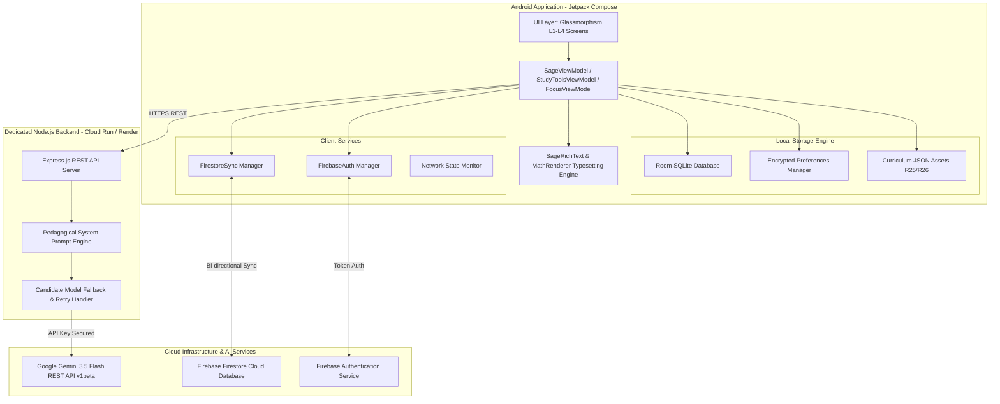

# Sage AI

### *Curriculum-Grounded AI Learning Companion*

[-3DDC84.svg?style=flat&logo=android&logoColor=white)](https://www.android.com)
[](https://kotlinlang.org)
[](https://developer.android.com/jetpack/compose)
[](https://ai.google.dev/)
[](https://nodejs.org)
[](https://render.com)
[-009688.svg?style=flat)](https://developer.android.com/training/data-storage/room)
[](https://firebase.google.com)
[](LICENSE)

---

> **"The goal wasn't to build another AI chatbot. The goal was to build an academic system around AI."**

**Sage AI** is a curriculum-grounded learning companion engineered natively for Android. Unlike generic chatbots that provide isolated, unverified answers to disconnected prompts, Sage anchors modern Large Language Models (**Google Gemini 3.5 Flash**) to official university and college academic syllabi.

In Sage, **the academic curriculum acts as the single source of truth**, while Gemini provides pedagogical instruction, multi-modal reasoning, active recall quizzing, and personalized remediation.

---

## 📑 Table of Contents

1. [Project Overview](#1-project-overview)
2. [Problem Statement](#2-problem-statement)
3. [The Sage Solution](#3-the-sage-solution)
4. [Key Features & Capabilities](#4-key-features--capabilities)
   - [Conversational AI Tutor](#conversational-ai-tutor)
   - [Textbook-Grade LaTeX & Math Rendering](#textbook-grade-latex--math-rendering)
   - [Official Academic Curriculum Integration](#official-academic-curriculum-integration)
   - [Multi-Modal AI Study Tools](#multi-modal-ai-study-tools)
   - [Focus Mode & Pomodoro Workspaces](#focus-mode--pomodoro-workspaces)
   - [Daily Missions & Streak Engine](#daily-missions--streak-engine)
   - [Adaptive Learning & Weekly Retention Review](#adaptive-learning--weekly-retention-review)
   - [Previous Year Questions (PYQ) Archive](#previous-year-questions-pyq-archive)
   - [Firebase Cloud Sync & Offline-First Persistence](#firebase-cloud-sync--offline-first-persistence)
   - [Developer & Admin Console](#developer--admin-console)
5. [Why Sage is Different](#5-why-sage-is-different)
6. [System Architecture](#6-system-architecture)
7. [Technology Stack](#7-technology-stack)
8. [Database Schema & Data Models](#8-database-schema--data-models)
9. [Backend API Reference](#9-backend-api-reference)
10. [Installation & Setup Guide](#10-installation--setup-guide)
11. [Testing & Quality Assurance](#11-testing--quality-assurance)
12. [Security, Privacy & Ethics](#12-security-privacy--ethics)
13. [License](#13-license)

---

## 1. Project Overview

Sage transforms self-directed learning from passive reading into an active, verified cognitive workflow. Designed for engineering and professional degree students (B.Tech, BBA, MCA), Sage structures every conversation around official course outcomes, unit modules, and evaluation criteria.

### Core Philosophy: *"The Syllabus is the Roadmap"*

Traditional AI tools operate in a vacuum: they answer whatever is asked without knowing what course you are taking, what semester you are in, or what exam questions you will face. Sage reverses this paradigm:

```
┌─────────────────────────────────────────────────────────────┐
│                 OFFICIAL CURRICULUM DATABASE                │
│ (JIS College of Engineering / MAKAUT • Regulations R25/R26) │
└──────────────────────────────┬──────────────────────────────┘
                               │ Injects Course Code, Module, Outcomes & Prerequisites
┌──────────────────────────────▼──────────────────────────────┐
│                   ACADEMIC CONTEXT ENGINE                   │
│   (Department • Semester • Subject • Module • Syllabus)     │
└──────────────────────────────┬──────────────────────────────┘
                               │ Grounds Gemini System Prompts
┌──────────────────────────────▼──────────────────────────────┐
│                    GEMINI AI TUTOR ENGINE                   │
│ (Learning Mode • Socratic Dialogue • Mathematical Proofs)   │
└──────────────────────────────┬──────────────────────────────┘
                               │ Drives Active Learning
┌──────────────────────────────▼──────────────────────────────┐
│                  INTEGRATED STUDY WORKSPACE                 │
│  (Scan & Solve • Flashcards • Notes • Mind Maps • Formulas) │
└──────────────────────────────┬──────────────────────────────┘
                               │ Tracks Progress & Mastery
┌──────────────────────────────▼──────────────────────────────┐
│               ADAPTIVE REVIEW & PROGRESS ENGINE             │
│   (Room Database • Weekly Reviews • Weak Concept Practice)  │
└─────────────────────────────────────────────────────────────┘
```

---

## 2. Problem Statement

University students facing rigorous technical syllabi encounter fundamental barriers when using conventional study methods or general-purpose AI chatbots:

1. **Lack of Curriculum Alignment**: General AI answers often explain concepts using conventions, notations, or frameworks outside the student's prescribed syllabus, causing confusion during exams.
2. **The "Passive Learning Trap"**: Reading static textbook pages or watching video lectures leads to rapid retention decay (the Ebbinghaus Forgetting Curve) without retrieval practice.
3. **Disorganized Study Resources**: Notes, flashcards, past exam papers (PYQs), formulas, and practice quizzes reside across disparate apps and unindexed PDF files.
4. **Unformatted Mathematical Syntax**: Standard AI chats output raw, difficult-to-read LaTeX strings (e.g. `\frac{1}{2\pi fC}`) rather than publication-quality mathematical notation.
5. **No Learning Path Continuity**: Standard chat interfaces lose track of which syllabus modules have been completed and where learning gaps exist.

---

## 3. The Sage Solution

Sage provides a single, unified, local-first academic platform where:

- Every study session is explicitly linked to an **Academic Profile** (Department, Degree, Regulation, Semester, Subject, and Module).
- AI interactions adhere to a **7-Step Pedagogical Framework**: goal alignment $\rightarrow$ knowledge probing $\rightarrow$ level calibration $\rightarrow$ concept delivery $\rightarrow$ comprehension checks $\rightarrow$ milestone quizzes $\rightarrow$ synthesis.
- Mathematical equations render as textbook typesetting using native Jetpack Compose AST parsing.
- Students generate on-demand study artifacts (flashcards, concept trees, formula sheets, notes, solutions) directly from syllabus topics.
- Data persists locally in SQLite via Room and seamlessly synchronizes across devices with Firebase Auth and Firestore.

---

## 4. Key Features & Capabilities

### Conversational AI Tutor
- **3 Pedagogical Modes**:
  - **🎓 Learning Mode**: Structured, step-by-step curriculum instruction with micro-comprehension checks before advancing.
  - **🏛️ Socratic Mode**: Guided inquiry that prompts students with reflective questions to build first-principles reasoning.
  - **⚡ Normal Mode**: Concise, direct academic briefings for rapid clarification.
- **In-Place Message Editing**: Tap **Edit** on any sent message to modify the prompt in a native glassmorphism editor. Sage updates the message, prunes subsequent downstream turns, and cleanly regenerates the conversation branch.
- **AI Response Retry**: Regenerate AI responses with one tap while preserving conversation context and rolling back safely if a network error occurs.
- **Fluid Keyboard Docking**: Dynamic Android window insets dock the input bar directly above the soft keyboard with zero vertical gaps.

### Textbook-Grade LaTeX & Math Rendering
- **`SageRichText` & `MathRenderer`**: Custom Kotlin typesetting engine that parses Markdown blocks and converts LaTeX expressions into mathematical typography.
- **Mathematical Glyph Translation**: Automatic rendering for fractions ($\frac{a}{b}$), radicals ($\sqrt{x}$), integrals ($\int$), summations ($\sum$), Greek symbols ($\alpha, \beta, \pi, \theta, \omega, \Delta, \lambda$), subscripts ($X_L, V_{rms}$), superscripts ($R^2$), and matrices.
- **`MathFormulaCard`**: Dedicated mathematical display cards with stacked fraction division bars, variable tables, SI units, and one-tap clipboard copying.

### Official Academic Curriculum Integration
- **Complete Department Databases**:
  - Computer Science & Engineering (AI & ML)
  - Information Technology (IT)
  - Computer Science & Technology (CST)
  - Electronics & Communication Engineering (ECE)
  - Electrical Engineering (EE)
  - Mechanical Engineering (ME)
  - Civil Engineering (CE)
  - Biomedical Engineering (BME)
  - Bachelor of Business Administration (BBA)
  - Master of Computer Applications (MCA)
- **Course Syllabus Metadata**: Course code, semester, credit weight, prerequisites, course outcomes (COs), prescribed textbooks, and detailed unit-by-unit syllabus outlines.

### Multi-Modal AI Study Tools
Integrated directly inside the chat workspace and as dedicated full-screen modules:
- 📸 **Scan & Solve (Visual Vision AI)**: Uses the Android Photo Picker and camera input to parse textbook numericals, circuit diagrams, and handwritten equations into step-by-step LaTeX solutions.
- 📝 **Comprehensive Academic Notes**: Structured notes with summaries, section headings, key takeaways, and practical examples.
- 🗂️ **Interactive Flashcards**: Dual-sided active recall cards with smooth 3D flip animations and cognitive hints.
- 🧠 **Hierarchical Mind Maps**: Interactive conceptual trees mapping central syllabus topics into sub-branches and leaf concepts.
- ⚡ **Rapid Exam Revision Sheets**: High-yield summaries, high-frequency exam facts, and common student misconceptions.
- 📐 **Formula Sheets with SI Units**: Mathematical equations paired with variable definitions, standard units, and application contexts.

### Focus Mode & Pomodoro Workspaces
- **Customizable Intervals**: 5-minute quick mission focus, 25-minute standard Pomodoro, and 50-minute deep study blocks.
- **Integrated Checkpoints**: Periodic comprehension checks during extended focus sessions.
- **"I'm Stuck" AI Rescue**: In-session contextual helper that breaks down difficult concepts without derailing focus time.
- **Dedicated Topic Selector**: High-contrast, non-transparent modal dialog with instant search, department filtering, and module breakdown.

### Daily Missions & Streak Engine
- **Automated Daily Study Quests**: Structured syllabus missions comprising *Learn*, *Practice*, *PYQ Analysis*, and *Review* tasks.
- **Streak & Study Time Tracking**: Real-time statistics on active daily streaks, lifetime focus minutes, and total concepts mastered.

### Adaptive Learning & Weekly Retention Review
- **Weak Concept Identification**: Automatically flags concepts missed during quizzes and provides targeted practice exercises.
- **Weekly Analytics**: Visual charts summarizing focus time, quiz mastery percentages, and syllabus completion velocity.

### Previous Year Questions (PYQ) Archive
- **Exam Archive**: Filter past university questions by year, subject, and module.
- **AI Solution Prompts**: Open any question directly into the AI tutor to inspect full step-by-step exam solutions.

### Firebase Cloud Sync & Offline-First Persistence
- **Local SQLite Storage (Room)**: Every message, topic, note, flashcard, and quiz result is immediately written to Room.
- **Firebase Authentication & Firestore**: Secure email/password authentication with background synchronization of user profiles, progress, and study tools across devices.

### Developer & Admin Console
- **Live System Telemetry**: Live heartbeat probes to Gemini API, latency monitoring (ms), model verification, and custom backend URL overrides.
- **Admin Dashboard**: User management, support ticket administration, and system health monitoring.

---

## 5. Why Sage is Different

| Dimension | Generic AI Chatbots | Sage AI Learning Companion |
| :--- | :--- | :--- |
| **Source of Truth** | Unconstrained internet data | **Official College Curriculum Syllabus (R25/R26)** |
| **Teaching Methodology** | Monolithic text output | **7-Step Guided Pedagogical Framework & Socratic Dialogue** |
| **Math Formatting** | Raw LaTeX strings (`\frac{1}{2\pi fC}`) | **Textbook-Grade Typeset Fractions, Radicals & Glyphs** |
| **Academic Context** | Forgotten between prompts | **Persistent Profile (Dept, Sem, Subject, Module, COs)** |
| **Study Artifacts** | Unstructured chat text | **Structured Notes, Flashcards, Mind Maps & Formula Sheets** |
| **Visual Problem Solving**| Generic text prompts | **Scan & Solve Camera Pipeline with Step-by-Step Rationale** |
| **Time Management** | None | **Built-in Focus Mode & Pomodoro with "I'm Stuck" Rescue** |
| **Data Architecture** | Ephemeral, cloud-only chat | **Local-First SQLite Room Database + Firestore Sync** |

---

## 6. System Architecture



---

## 7. Technology Stack

### Android Mobile Client
- **Language**: Kotlin 2.0.21 (Coroutines, StateFlow, Flow)
- **UI Toolkit**: Jetpack Compose with Material Design 3 (M3)
- **Design System**: Glassmorphism (Surface elevation levels L1 to L4, ambient glows)
- **Local Persistence**: Android Room 2.6.1 SQLite with KSP
- **Image Loading**: Coil Compose 2.7.0
- **Serialization**: KotlinX Serialization JSON & Moshi 1.15.2
- **Networking**: Retrofit 2.11.0 & OkHttp 4.12.0
- **Authentication & Cloud**: Firebase Auth & Firebase Firestore Android SDKs
- **Testing**: Robolectric 4.14.1, JUnit 4, MockK, Roborazzi

### Backend Server (Proxy & Study Tools Engine)
- **Runtime**: Node.js 18+ (Express.js)
- **Deployment**: Render Cloud Run Docker container
- **AI Model**: Google Gemini 3.5 Flash (`gemini-3.5-flash` / `gemini-3.5-flash-lite`)
- **API Protocol**: JSON REST over HTTPS with `X-Request-ID` telemetry

---

## 8. Database Schema & Data Models

Sage persists data locally using Android Room:

```
┌───────────────────────────┐      ┌───────────────────────────┐
│          topics           │      │         messages          │
├───────────────────────────┤      ├───────────────────────────┤
│ id: Long (PK)             │1    *│ id: Long (PK)             │
│ title: String             ├─────►│ topicId: Long (FK)        │
│ mode: String              │      │ role: String (user/model) │
│ goal: String              │      │ content: String           │
│ roadmapJson: String       │      │ timestamp: Long           │
│ updatedAt: Long           │      │ status: String            │
└───────────────────────────┘      └───────────────────────────┘

┌───────────────────────────┐      ┌───────────────────────────┐
│     academic_profile      │      │     saved_study_tools     │
├───────────────────────────┤      ├───────────────────────────┤
│ id: String (PK: 'primary')│      │ id: String (PK)           │
│ departmentId: String      │      │ type: String              │
│ departmentName: String    │      │ title: String             │
│ semester: Int             │      │ subject: String           │
│ regulation: String        │      │ dataJson: String          │
│ updatedAt: Long           │      │ updatedAt: Long           │
└───────────────────────────┘      └───────────────────────────┘

┌───────────────────────────┐      ┌───────────────────────────┐
│      daily_missions       │      │      focus_sessions       │
├───────────────────────────┤      ├───────────────────────────┤
│ id: String (PK)           │      │ id: Long (PK)             │
│ dateKey: String           │      │ topicTitle: String        │
│ title: String             │      │ targetDurationMinutes: Int│
│ tasksJson: String         │      │ actualFocusedSeconds: Long│
│ completed: Boolean        │      │ completed: Boolean        │
└───────────────────────────┘      └───────────────────────────┘
```

---

## 9. Backend API Reference

The backend Express proxy coordinates communication with Gemini:

### `GET /api/health`
Health check and Gemini connectivity probe.
- **Query Parameter**: `?checkGemini=true`
- **Response**: `{ ok: true, geminiConnected: true, model: "gemini-3.5-flash", latency: 680 }`

### `POST /api/chat`
Conversational endpoint grounded in pedagogical modes.
```json
{
  "message": "Explain Round Robin scheduling with an example.",
  "history": [
    { "role": "user", "text": "What is CPU scheduling?" },
    { "role": "model", "text": "CPU scheduling is the process..." }
  ],
  "mode": "learning",
  "systemPrompt": "OFFICIAL ACADEMIC CURRICULUM CONTEXT:\nCourse: CS301 - Operating Systems..."
}
```

### `POST /api/study-tools`
Multi-modal and structured study artifact generation endpoint.
- **Supported Operations**: `notes`, `flashcards`, `mindmap`, `revision`, `formulas`, `solve_image`.
- **Payload**: Includes `operation`, `topic`, `subject`, `academicContext`, and optional `imageBase64` for image analysis.

---

## 10. Installation & Setup Guide

### Method 1: Direct APK Installation (Fastest)
1. Download the latest `Sage.apk` from the [Releases](../../releases) tab.
2. Open the APK on your Android device (Android 8.0+).
3. Grant **Allow from this source** if prompted.
4. Open Sage and connect to your AI study workspace!

### Method 2: Build from Source in Android Studio
```bash
# 1. Clone the repository
git clone https://github.com/your-username/sage-ai.git
cd sage-ai

# 2. Set up environment configuration
cp .env.example .env

# 3. Open .env and add your Gemini API Key:
# GEMINI_API_KEY=<YOUR_GEMINI_API_KEY>

# 4. Build the debug APK via Gradle
gradle assembleDebug
```
The compiled APK will be output to:
`app/build/outputs/apk/debug/app-debug.apk`

---

## 11. Testing & Quality Assurance

Sage maintains high test coverage through local JVM Robolectric and unit tests:

| Test Suite | Purpose |
| :--- | :--- |
| `ChatEditAndRetryTest.kt` | Tests in-place message editing, conversation branch pruning, AI retry, and rollback protection. |
| `SageRichTextMathTest.kt` | Verifies LaTeX parsing, stacked fractions, square roots, Greek symbols, and Markdown AST. |
| `CurriculumTest.kt` | Validates multi-department JSON schema integrity and syllabus course mappings. |
| `DailyMissionTest.kt` | Tests daily quest generation, syllabus task rotation, and streak logic. |
| `FocusModeTest.kt` | Verifies Pomodoro timer states, goal derivation, and checkpoint validations. |
| `StudyToolsSerializationTest.kt` | Tests JSON serialization/deserialization for all 6 study tool models. |
| `FirestoreSyncTest.kt` | Verifies bi-directional cloud synchronization between Room and Firestore. |
| `AdminAuthorizationTest.kt` | Tests developer console access control and role-based permissions. |

To run the automated test suite:
```bash
gradle testDebugUnitTest
```

---

## 12. Security, Privacy & Ethics

- **Zero Third-Party Trackers**: Sage contains no third-party advertising SDKs, behavioral analytics, or data brokers.
- **Local-First Architecture**: Your chat history, notes, and quiz performance reside in your device's private SQLite database.
- **Secure Key Management**: Secrets are injected via `BuildConfig` and the Gradle Secrets Plugin. Keys are never hardcoded in source files.
- **Academic Grounding**: Prevents hallucinations by bounding Gemini explanations within verified syllabus content.

---

## 13. License

Sage is open-source software licensed under the **Apache License 2.0**. See the [LICENSE](LICENSE) file for details.

---

<p align="center">
  <b>Built with ❤️ for students, educators, and developers.</b><br>
  <i>Empowering learners to master their academic curriculum, one concept at a time.</i>
</p>
